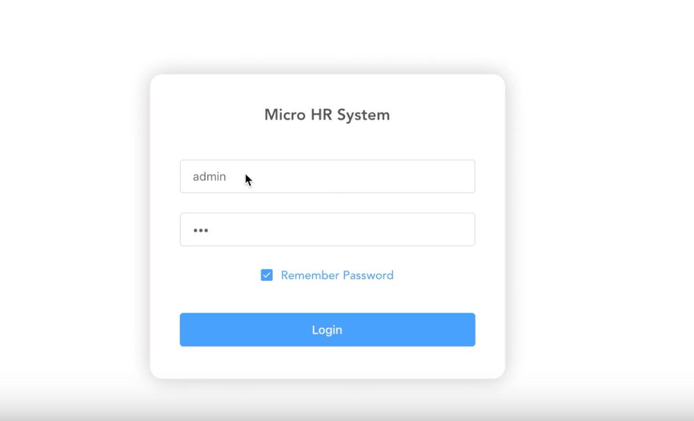

# Micro-HR-System
* [Demo Video](https://drive.google.com/file/d/1bdi3fWUGmzeylp4cx3JlZVZ7_21MrnCf/view)

## Overview
* Developed a micro system for company management based on front-end and back-end separation
* Utilized Element UI for front-end component design and connected URLs with Vue-router to switch pages, such as switching from home to salary management
* Adopted Axios to finish Ajax requests when managing employee permissions and finished data cache with localStorage
* Utilized Spring Security to finish login verification, including servlet interception and request filter with FilterToBeanProxy
* Utilized Spring Boot for Maven management based on the MVC model and developed a RESTful API for the interaction between front-end and back-end with json format
* Finished database operations with MySQL and MyBatis to store information such as employees, salaries, etc.

## Technology Stack

* ElementUI
* Vue
* Axio
* LocalStorage
* Spring Security
* Spring MVC
* RESTful API
* Spring Boot
* MySQL
* MyBatis

## Installing and Configuration
* Vue [https://cn.vuejs.org/index.html](https://cn.vuejs.org/index.html)
* Spring Security [https://spring.io/projects/spring-security](https://spring.io/projects/spring-security)
* Spring Boot [https://spring.io/projects/spring-boot](https://spring.io/projects/spring-boot)
* MyBatis [https://mybatis.org/mybatis-3/](https://mybatis.org/mybatis-3/)
* MySQL [https://www.mysql.com/cn/downloads/](https://www.mysql.com/cn/downloads/)

```
$ sudo service mysql start   
$ mysql -u root  
$ create database vhr;
$ mysql -u root -p vhr < vhr.sql
```
## Start Project
```
$ mvn spring-boot:run
```
## Demo Pictures

* Login Page



* Employee Information


* Training Management


* Salary Management


* Permission Management

